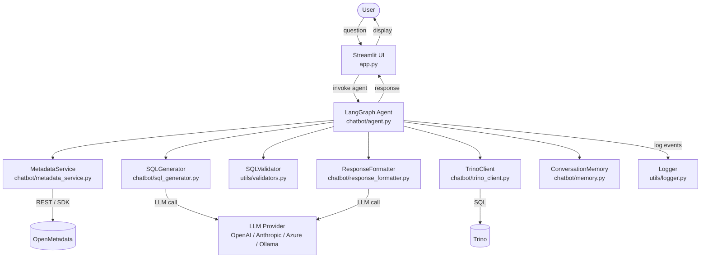
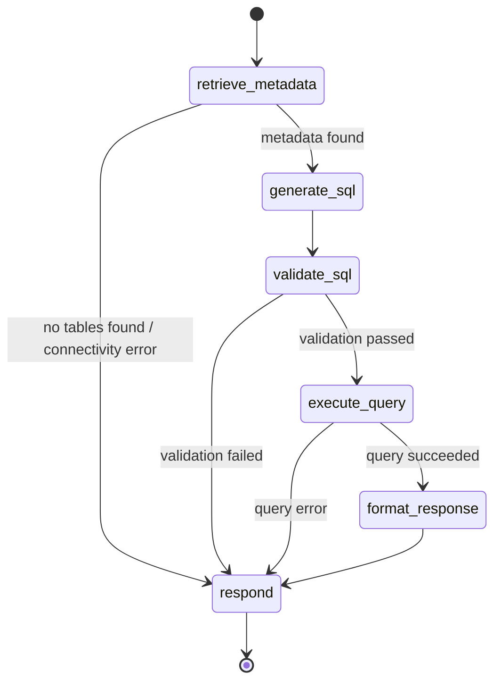

# Design Document: GlassBot

## Overview

GlassBot is an AI-powered conversational analytics assistant for the Glass Bottle Manufacturing domain. It bridges natural language and structured data by orchestrating a multi-step pipeline:

1. Accept a user question via a Streamlit chat UI
2. Retrieve relevant table metadata from OpenMetadata
3. Generate Trino-compatible SQL using an LLM with full metadata context
4. Validate the SQL against a safety allowlist/blocklist
5. Execute the query against Trino
6. Summarise the results in plain English and render them in the UI

The system is inspired by ontology-driven querying (similar to Palantir Foundry) where business meaning—table descriptions, column semantics, tags, and relationships—is injected into the LLM prompt rather than relying on schema guessing.

### Key Design Decisions

- **LangGraph over plain LangChain chains**: LangGraph's directed-graph model gives explicit, inspectable control over each pipeline step, conditional branching on errors, and built-in state persistence. This makes it easy to short-circuit at metadata-not-found or SQL-rejected stages without tangled if/else logic in a monolithic chain.
- **`init_chat_model` for provider abstraction**: LangChain's universal factory function accepts a `LLM_PROVIDER:model-name` string and instantiates the correct `BaseChatModel` subclass. No custom adapter layer is needed.
- **sqlparse for SQL validation**: A lightweight, pure-Python SQL parser that extracts the DML type without requiring a Trino connection or dialect configuration.
- **Session-scoped in-memory state**: Conversation history lives in LangGraph's `InMemorySaver` checkpointer keyed by a session ID. When the user clears the conversation, Streamlit creates a new session ID, effectively discarding history.

---

## Architecture

### High-Level Data Flow



### LangGraph Workflow

The agent is implemented as a LangGraph `StateGraph`. Each node performs one unit of work and writes its results back to the shared `AgentState`. Conditional edges route to the terminal `respond` node on any error.



---

## Components and Interfaces

### `app.py` – Streamlit Entry Point

Responsibilities:
- Render the chat input, chat history, and sidebar (clear-conversation button, metadata panel, SQL viewer)
- Maintain `st.session_state` for messages and session ID
- Invoke the LangGraph agent and stream/display the structured response
- Show the loading spinner while the agent is working
- Render query results as `st.dataframe`, SQL as a collapsible `st.expander`, and metadata as a collapsible `st.expander`

### `config.py` – Configuration

Reads all configuration from environment variables (populated from `.env` via `python-dotenv`). Raises a `ValueError` at import time if a required variable is missing, causing the application to exit before the UI loads.

```python
class Config:
    # LLM
    LLM_PROVIDER: str          # e.g. "openai:gpt-4o"
    OPENAI_API_KEY: str
    AZURE_OPENAI_ENDPOINT: str | None
    ANTHROPIC_API_KEY: str | None
    OLLAMA_BASE_URL: str | None

    # Trino
    TRINO_HOST: str
    TRINO_PORT: int             # default 8080
    TRINO_CATALOG: str
    TRINO_SCHEMA: str
    TRINO_USER: str             # default "glassbot"

    # OpenMetadata
    OPENMETADATA_URL: str
    OPENMETADATA_API_TOKEN: str

    # Logging
    LOG_LEVEL: str              # default "INFO"
    LOG_FILE: str               # default "glassbot.log"
```

Required variables (absence causes startup error): `LLM_PROVIDER`, `TRINO_HOST`, `TRINO_CATALOG`, `TRINO_SCHEMA`, `OPENMETADATA_URL`, `OPENMETADATA_API_TOKEN`.

### `chatbot/agent.py` – LangGraph Orchestrator

Defines `AgentState` (a `TypedDict`) and builds the `StateGraph`.

```python
class AgentState(TypedDict):
    question: str
    conversation_history: list[BaseMessage]
    metadata: list[TableMetadata] | None
    sql: str | None
    validation_result: ValidationResult
    query_result: QueryResult | None
    summary: str | None
    error: str | None
    error_source: str | None
```

Graph nodes (each is a pure Python function receiving and returning `AgentState`):

| Node | Calls | Writes |
|---|---|---|
| `retrieve_metadata` | `MetadataService.search_tables` | `metadata`, `error` |
| `generate_sql` | `SQLGenerator.generate` | `sql`, `error` |
| `validate_sql` | `SQLValidator.validate` | `validation_result`, `error` |
| `execute_query` | `TrinoClient.execute` | `query_result`, `error` |
| `format_response` | `ResponseFormatter.format` | `summary`, `error` |
| `respond` | — | final assembled response |

Routing: after each node, a conditional edge checks `state["error"]`. If set, it routes directly to `respond` with the error message; otherwise it continues to the next node in the sequence.

The agent is instantiated once at application startup and kept in `st.session_state`. Each invocation passes the current session's `thread_id` to the `InMemorySaver` checkpointer, enabling multi-turn memory.

### `chatbot/metadata_service.py` – OpenMetadata Integration

```python
class TableMetadata:
    fqn: str                    # catalog.schema.table
    name: str
    description: str
    columns: list[ColumnInfo]   # name, type, description
    tags: list[str]
    relationships: list[str]    # downstream/upstream table FQNs

class MetadataService:
    def search_tables(self, question: str, limit: int = 5) -> list[TableMetadata]: ...
```

Implementation strategy:
- Uses the OpenMetadata REST API endpoint `GET /api/v1/search/query?q={question}&index=table_search_index&size={limit}` via `httpx` (lightweight, async-compatible).
- Falls back to the `openmetadata-sdk` Python package if more structured access is needed for relationship traversal.
- Returns at most `limit` (default 5) results to cap LLM context size.
- Raises `MetadataConnectivityError` on network failure; raises `MetadataNotFoundError` when the result list is empty.

### `chatbot/sql_generator.py` – SQL Generation

```python
class SQLGenerator:
    def __init__(self, llm: BaseChatModel, prompts: PromptTemplates): ...
    def generate(self, question: str, metadata: list[TableMetadata],
                 history: list[BaseMessage]) -> str: ...
```

Prompt construction (in `chatbot/prompts.py`):

1. **System prompt**: Role definition ("You are a Trino SQL expert…"), rules (use fully qualified names, avoid `SELECT *`, prefer explicit JOINs, apply LIMIT by default), and output format (respond with SQL only, no explanation, no markdown fences).
2. **Metadata block**: Rendered table schemas—name, description, columns with types and descriptions, tags, relationships—injected as a `SystemMessage` or structured `HumanMessage`.
3. **Conversation history**: Last N turns from `ConversationMemory`, trimmed to stay within token limits using `langchain_core.messages.trim_messages`.
4. **User question**: The current question as the final `HumanMessage`.

The LLM is instantiated via `langchain.chat_models.init_chat_model(config.LLM_PROVIDER)`, making the provider fully swappable.

### `chatbot/prompts.py` – Prompt Templates

Contains:
- `SYSTEM_PROMPT`: Core SQL generation rules and persona
- `METADATA_TEMPLATE`: Jinja2 / f-string template for rendering `TableMetadata` objects into the LLM context
- `SUMMARY_PROMPT`: Instructions for the `ResponseFormatter` LLM call

### `chatbot/memory.py` – Conversation Memory

```python
class ConversationMemory:
    def __init__(self, max_turns: int = 10): ...
    def add_turn(self, user_msg: str, assistant_msg: str, sql: str | None): ...
    def get_history(self) -> list[BaseMessage]: ...
    def clear(self): ...
```

In practice, `ConversationMemory` wraps the message list stored in LangGraph's `AgentState`. For session persistence, the `InMemorySaver` checkpointer is keyed by `thread_id` (a UUID stored in `st.session_state`). Clearing the conversation creates a new `thread_id`, abandoning the old checkpoint.

The minimum 10-turn retention requirement is satisfied by keeping the full message list in state and trimming only when the list exceeds token limits for the LLM call (using `trim_messages` with a token counter).

### `utils/validators.py` – SQL Validator

```python
class ValidationResult:
    is_valid: bool
    statement_type: str | None   # "SELECT", "WITH", "EXPLAIN", "DELETE", etc.
    error_message: str | None

ALLOWLIST = {"SELECT", "WITH", "EXPLAIN"}
BLOCKLIST = {"DELETE", "UPDATE", "INSERT", "DROP", "ALTER", "TRUNCATE", "CREATE"}

class SQLValidator:
    def validate(self, sql: str) -> ValidationResult: ...
```

Algorithm:
1. Strip leading whitespace and comments.
2. Use `sqlparse.parse(sql)` to obtain the statement AST.
3. Walk tokens to find the first `DML` or `Keyword` token (skipping whitespace and comments).
4. Normalise to uppercase and check against `ALLOWLIST` / `BLOCKLIST`.
5. If the token cannot be identified, return `ValidationResult(is_valid=False, error_message="unparseable-SQL")`.

### `chatbot/trino_client.py` – Query Execution

```python
@dataclass
class QueryResult:
    rows: list[dict]
    row_count: int
    execution_time_ms: float
    truncated: bool
    truncation_limit: int | None

class TrinoClient:
    def __init__(self, config: Config): ...
    def execute(self, sql: str, row_limit: int = 1000) -> QueryResult: ...
```

Implementation:
- Uses `trino.dbapi.connect(host, port, user, catalog, schema)` from the `trino` PyPI package.
- Wraps execution in `time.perf_counter()` for wall-clock timing.
- Fetches up to `row_limit + 1` rows; if `row_limit + 1` rows come back, truncates to `row_limit` and sets `truncated=True`.
- Catches `trino.exceptions.TrinoQueryError` and re-raises as `QueryExecutionError` (a domain exception) with the Trino error message, stripping the internal stack trace.

### `chatbot/executor.py` – Execution Coordination

Thin wrapper that ties `SQLValidator` and `TrinoClient` together. Called by the `execute_query` LangGraph node to validate-then-execute as an atomic step with unified error handling.

### `chatbot/response_formatter.py` – Natural Language Summary

```python
class ResponseFormatter:
    def __init__(self, llm: BaseChatModel): ...
    def format(self, question: str, result: QueryResult) -> str: ...
```

- Calls the LLM with the `SUMMARY_PROMPT`, the original question, result rows (truncated to first 100 rows for the prompt to avoid token overflow), row count, and execution time.
- Always includes row count and execution time in the returned summary string.
- If `result.row_count == 0`, returns a canned "no data matched" message without an LLM call.

### `utils/logger.py` – Structured Logging

```python
def get_logger(component: str) -> logging.Logger: ...
```

- Configures one root logger at startup with two handlers: `StreamHandler` (stdout) and `FileHandler` (path from `config.LOG_FILE`).
- Each handler uses a formatter that emits: `%(asctime)s | %(levelname)s | %(name)s | %(message)s`.
- Log level read from `config.LOG_LEVEL`; defaults to `INFO`.
- Each module obtains a named logger via `get_logger(__name__)`.

### `utils/helpers.py` – Utilities

Miscellaneous helpers: token counting (`tiktoken`), message trimming, result row serialisation for logging, and table rendering helpers.

---

## Data Models

### `TableMetadata`

```python
@dataclass
class ColumnInfo:
    name: str
    data_type: str
    description: str | None

@dataclass
class TableMetadata:
    fqn: str                          # "catalog.schema.table"
    name: str
    description: str | None
    columns: list[ColumnInfo]
    tags: list[str]
    relationships: list[str]          # FQNs of related tables
```

### `QueryResult`

```python
@dataclass
class QueryResult:
    rows: list[dict[str, Any]]
    row_count: int
    execution_time_ms: float
    truncated: bool
    truncation_limit: int | None      # None if not truncated
```

### `ValidationResult`

```python
@dataclass
class ValidationResult:
    is_valid: bool
    statement_type: str | None
    error_message: str | None
```

### `AgentState`

```python
class AgentState(TypedDict):
    question: str
    conversation_history: list[BaseMessage]
    metadata: list[TableMetadata] | None
    sql: str | None
    validation_result: ValidationResult | None
    query_result: QueryResult | None
    summary: str | None
    error: str | None
    error_source: str | None          # component name for logging
```

### Domain Exceptions

```python
class GlassBotError(Exception): ...
class MetadataConnectivityError(GlassBotError): ...
class MetadataNotFoundError(GlassBotError): ...
class SQLValidationError(GlassBotError): ...
class QueryExecutionError(GlassBotError): ...
class LLMError(GlassBotError): ...
class ConfigurationError(GlassBotError): ...
```

---

## Correctness Properties

*A property is a characteristic or behavior that should hold true across all valid executions of a system—essentially, a formal statement about what the system should do. Properties serve as the bridge between human-readable specifications and machine-verifiable correctness guarantees.*

### Property 1: SQL Validation Allowlist

*For any* SQL string whose first meaningful keyword is SELECT, WITH, or EXPLAIN (regardless of case, leading whitespace, or inline comments), the `SQLValidator` SHALL return a `ValidationResult` where `is_valid` is `True` and `statement_type` matches the keyword.

**Validates: Requirements 4.1, 4.4**

### Property 2: SQL Validation Blocklist

*For any* SQL string whose first meaningful keyword is one of DELETE, UPDATE, INSERT, DROP, ALTER, TRUNCATE, or CREATE (regardless of case or leading whitespace), the `SQLValidator` SHALL return a `ValidationResult` where `is_valid` is `False` and `error_message` is non-empty.

**Validates: Requirements 4.1, 4.2**

### Property 3: Generated SQL is a Safe Statement

*For any* valid natural language question that leads the `SQLGenerator` to produce a SQL string, parsing that SQL string with `SQLValidator` SHALL return `is_valid = True` with `statement_type` in {SELECT, WITH, EXPLAIN}. This is the round-trip guarantee: the SQL generation pipeline never produces destructive statements.

**Validates: Requirements 3.1, 14.4**

### Property 4: Row Limit Invariant

*For any* SQL query execution, the `QueryResult` returned by `TrinoClient` SHALL satisfy: if Trino returns N ≤ 1000 rows, then `len(rows) == row_count == N` and `truncated == False`; if Trino returns N > 1000 rows, then `len(rows) == 1000`, `row_count == 1000`, `truncated == True`, and `truncation_limit == 1000`.

**Validates: Requirements 5.3, 5.5**

### Property 5: Table Metadata Completeness

*For any* `TableMetadata` object returned by `MetadataService.search_tables`, the object SHALL contain a non-empty `name`, a non-empty `fqn` matching the pattern `catalog.schema.table` (exactly two dot separators, no empty segments), a non-empty `columns` list where each column has at minimum a `name` and `data_type`, and a `tags` field (empty list is acceptable).

**Validates: Requirements 2.2, 3.2**

### Property 6: Metadata Result Limit

*For any* question string, `MetadataService.search_tables(question, limit=5)` SHALL return a list of length at most 5.

**Validates: Requirements 2.5**

### Property 7: No SQL on Empty Metadata

*For any* question for which `MetadataService.search_tables` raises `MetadataNotFoundError`, the LangGraph agent SHALL route directly to the `respond` node and the `SQLGenerator` SHALL never be invoked within that pipeline run.

**Validates: Requirements 2.3, 8.1**

### Property 8: Rejected SQL is Never Executed

*For any* SQL string that `SQLValidator.validate` returns `is_valid == False` for, the `TrinoClient.execute` method SHALL never be called within that pipeline run.

**Validates: Requirements 4.2, 8.2**

### Property 9: Response Formatter Summary Invariants

*For any* non-empty `QueryResult`, the summary string returned by `ResponseFormatter.format` SHALL contain both the row count value and the execution time value from the `QueryResult`. *For any* `QueryResult` with `row_count == 0`, the returned summary SHALL be a non-empty string that describes the absence of data (i.e., does not silently return an empty string or a raw empty-table representation).

**Validates: Requirements 6.2, 6.3**

### Property 10: Conversation History Retention and Reset

*For any* sequence of up to 10 conversation turns added via `ConversationMemory.add_turn`, `get_history()` SHALL return all turns in insertion order with one `HumanMessage` and one `AIMessage` per turn. After `ConversationMemory.clear()` is called, `get_history()` SHALL return an empty list regardless of how many turns were previously added.

**Validates: Requirements 7.3, 7.4**

### Property 11: Missing Configuration Variable Error

*For any* required configuration variable that is absent from the environment at startup, the `Config` initialisation SHALL raise a `ConfigurationError` whose message contains the name of the missing variable.

**Validates: Requirements 11.3**

### Property 12: Prompt Contains Metadata Context

*For any* list of `TableMetadata` objects passed to `SQLGenerator.generate`, the LLM prompt constructed by the generator SHALL contain each table's fully qualified name, its column names with types, and its relationships, so that the LLM has full schema context for join generation.

**Validates: Requirements 3.2, 3.5**

---

## Error Handling

### Error Taxonomy

| Error | Source Component | Agent Response |
|---|---|---|
| `MetadataNotFoundError` | `MetadataService` | "No relevant tables found—please rephrase." |
| `MetadataConnectivityError` | `MetadataService` | "OpenMetadata is unreachable—connectivity error." |
| `SQLValidationError` | `SQLValidator` | "Query rejected: {reason}. No execution attempted." |
| `QueryExecutionError` | `TrinoClient` | "Query failed: {plain-language message}." |
| `LLMError` | `SQLGenerator` / `ResponseFormatter` | "Temporary LLM service issue—please try again." |
| `ConfigurationError` | `config.py` | Application exits at startup with descriptive message. |

### Error Flow in LangGraph

Each graph node catches its own exceptions and writes to `state["error"]` and `state["error_source"]`. The conditional edge after each node inspects `state["error"]`:

```python
def route_after_node(state: AgentState) -> str:
    if state.get("error"):
        return "respond"
    return "next_node"
```

This guarantees the `respond` node always fires and always has a message to display, whether from `state["summary"]` or `state["error"]`.

### Stack Trace Policy

Raw Python stack traces are never surfaced to the UI. The `respond` node formats the `error` field as a user-friendly sentence. Full tracebacks are written to the log at `ERROR` level by the raising component before setting `state["error"]`.

### Ambiguous Questions

When the LLM cannot confidently identify target tables and the metadata search returns multiple low-confidence matches, the `generate_sql` node detects this condition (via a structured LLM output that signals uncertainty) and sets `state["error"]` with a clarifying message listing the candidate tables.

---

## Testing Strategy

### Unit Tests (`tests/`)

Unit tests cover specific examples, boundary conditions, and error paths. They use `pytest` and `unittest.mock` for patching external services.

**SQLValidator** (`tests/test_validators.py`):
- Accept: SELECT, WITH (CTE), EXPLAIN (case-insensitive, leading whitespace, inline comments)
- Reject: DELETE, UPDATE, INSERT, DROP, ALTER, TRUNCATE, CREATE
- Reject: unparseable input (empty string, non-SQL text)

**MetadataService** (`tests/test_metadata_service.py`):
- Successful search: mock HTTP response → verify `TableMetadata` fields populated correctly
- Empty results: mock empty response → verify `MetadataNotFoundError` raised
- Connectivity error: mock `httpx.ConnectError` → verify `MetadataConnectivityError` raised

**ResponseFormatter** (`tests/test_response_formatter.py`):
- Non-empty result: mock LLM → verify summary contains row count and execution time
- Empty result: verify canned "no data" message returned without LLM call
- Inclusion of execution time in summary string

**TrinoClient** (`tests/test_trino_client.py`):
- Exactly 1000 rows: verify `truncated=False`, `row_count=1000`
- 1001 rows returned: verify `truncated=True`, `len(rows)=1000`
- Trino error: mock `TrinoQueryError` → verify `QueryExecutionError` raised, stack trace absent

### Property-Based Tests (`tests/test_properties.py`)

Uses **Hypothesis** as the property-based testing library. Each test runs a minimum of 100 iterations (configured via `@settings(max_examples=100)`).

**Property 1 – SQL Validation Allowlist** (`test_allowlist_statements`):

```python
@given(st.sampled_from(["SELECT", "WITH", "EXPLAIN"]).flatmap(valid_sql_strategy))
@settings(max_examples=100)
def test_allowlist_statements(sql: str):
    # Feature: glassbot, Property 1: SQL Validation Allowlist
    result = SQLValidator().validate(sql)
    assert result.is_valid is True
    assert result.statement_type in {"SELECT", "WITH", "EXPLAIN"}
```

**Property 2 – SQL Validation Blocklist** (`test_blocklist_statements`):

```python
@given(st.sampled_from(["DELETE", "UPDATE", "INSERT", "DROP", "ALTER", "TRUNCATE", "CREATE"])
       .flatmap(destructive_sql_strategy))
@settings(max_examples=100)
def test_blocklist_statements(sql: str):
    # Feature: glassbot, Property 2: SQL Validation Blocklist
    result = SQLValidator().validate(sql)
    assert result.is_valid is False
    assert result.error_message is not None
```

**Property 3 – Generated SQL is a Safe Statement** (`test_generated_sql_is_safe`):

```python
@given(valid_question_strategy())
@settings(max_examples=100)
def test_generated_sql_is_safe(question: str):
    # Feature: glassbot, Property 3: Generated SQL is a Safe Statement
    sql = SQLGenerator(mock_llm).generate(question, sample_metadata, [])
    result = SQLValidator().validate(sql)
    assert result.is_valid is True
    assert result.statement_type in {"SELECT", "WITH", "EXPLAIN"}
```

**Property 4 – Row Limit Invariant** (`test_row_limit_invariant`):

```python
@given(st.integers(min_value=0, max_value=5000))
@settings(max_examples=100)
def test_row_limit_invariant(n_rows: int):
    # Feature: glassbot, Property 4: Row Limit Invariant
    result = TrinoClient._apply_limit(mock_rows(n_rows), row_limit=1000)
    if n_rows <= 1000:
        assert len(result.rows) == n_rows
        assert result.row_count == n_rows
        assert result.truncated is False
    else:
        assert len(result.rows) == 1000
        assert result.row_count == 1000
        assert result.truncated is True
        assert result.truncation_limit == 1000
```

**Property 5 – Table Metadata Completeness** (`test_table_metadata_completeness`):

```python
@given(table_metadata_strategy())
@settings(max_examples=100)
def test_table_metadata_completeness(metadata: TableMetadata):
    # Feature: glassbot, Property 5: Table Metadata Completeness
    assert len(metadata.name) > 0
    parts = metadata.fqn.split(".")
    assert len(parts) == 3
    assert all(len(p) > 0 for p in parts)
    assert len(metadata.columns) > 0
    assert all(col.name and col.data_type for col in metadata.columns)
```

**Property 6 – Metadata Result Limit** (`test_metadata_limit`):

```python
@given(question_strategy())
@settings(max_examples=100)
def test_metadata_limit(question: str):
    # Feature: glassbot, Property 6: Metadata Result Limit
    metadata = mock_metadata_service.search_tables(question, limit=5)
    assert len(metadata) <= 5
```

**Property 7 – No SQL on Empty Metadata** (`test_no_sql_on_empty_metadata`):

```python
@given(question_strategy())
@settings(max_examples=100)
def test_no_sql_on_empty_metadata(question: str):
    # Feature: glassbot, Property 7: No SQL on Empty Metadata
    sql_generator_mock = MagicMock()
    agent = build_agent(metadata_service=raises_not_found_service(),
                        sql_generator=sql_generator_mock)
    agent.invoke({"question": question})
    sql_generator_mock.generate.assert_not_called()
```

**Property 8 – Rejected SQL is Never Executed** (`test_rejected_sql_not_executed`):

```python
@given(destructive_sql_strategy())
@settings(max_examples=100)
def test_rejected_sql_not_executed(sql: str):
    # Feature: glassbot, Property 8: Rejected SQL is Never Executed
    trino_mock = MagicMock()
    agent = build_agent(sql_generator=returns_sql(sql), trino_client=trino_mock)
    agent.invoke({"question": "any question", "metadata": sample_metadata})
    trino_mock.execute.assert_not_called()
```

**Property 9 – Response Formatter Summary Invariants** (`test_response_formatter_invariants`):

```python
@given(nonempty_query_result_strategy())
@settings(max_examples=100)
def test_summary_nonempty_contains_metadata(result: QueryResult):
    # Feature: glassbot, Property 9: Response Formatter Summary Invariants (non-empty)
    summary = ResponseFormatter(mock_llm).format("any question", result)
    assert str(result.row_count) in summary
    assert str(int(result.execution_time_ms)) in summary

@given(execution_time_strategy(), question_strategy())
@settings(max_examples=100)
def test_summary_empty_result_describes_absence(execution_time_ms: float, question: str):
    # Feature: glassbot, Property 9: Response Formatter Summary Invariants (empty)
    result = QueryResult(rows=[], row_count=0, execution_time_ms=execution_time_ms,
                         truncated=False, truncation_limit=None)
    summary = ResponseFormatter(mock_llm).format(question, result)
    assert len(summary) > 0
```

**Property 10 – Conversation History Retention and Reset** (`test_conversation_memory`):

```python
@given(st.lists(conversation_turn_strategy(), min_size=1, max_size=10))
@settings(max_examples=100)
def test_conversation_history_retention(turns: list[tuple[str, str]]):
    # Feature: glassbot, Property 10: Conversation History Retention
    memory = ConversationMemory(max_turns=10)
    for user_msg, assistant_msg in turns:
        memory.add_turn(user_msg, assistant_msg, sql=None)
    history = memory.get_history()
    assert len(history) == len(turns) * 2

@given(st.lists(conversation_turn_strategy(), min_size=1, max_size=10))
@settings(max_examples=100)
def test_conversation_history_reset(turns: list[tuple[str, str]]):
    # Feature: glassbot, Property 10: Conversation History Reset
    memory = ConversationMemory(max_turns=10)
    for user_msg, assistant_msg in turns:
        memory.add_turn(user_msg, assistant_msg, sql=None)
    memory.clear()
    assert memory.get_history() == []
```

**Property 11 – Missing Configuration Variable Error** (`test_missing_config_error`):

```python
@given(st.sampled_from(REQUIRED_CONFIG_VARS))
@settings(max_examples=100)
def test_missing_config_raises_with_var_name(missing_var: str):
    # Feature: glassbot, Property 11: Missing Configuration Variable Error
    env = {v: "placeholder" for v in REQUIRED_CONFIG_VARS if v != missing_var}
    with pytest.raises(ConfigurationError) as exc_info:
        Config(env=env)
    assert missing_var in str(exc_info.value)
```

**Property 12 – Prompt Contains Metadata Context** (`test_prompt_contains_metadata`):

```python
@given(st.lists(table_metadata_strategy(), min_size=1, max_size=5))
@settings(max_examples=100)
def test_prompt_contains_metadata_context(metadata_list: list[TableMetadata]):
    # Feature: glassbot, Property 12: Prompt Contains Metadata Context
    prompt = SQLGenerator(mock_llm)._build_prompt("any question", metadata_list, [])
    prompt_text = " ".join(str(m.content) for m in prompt)
    for table in metadata_list:
        assert table.fqn in prompt_text
        for col in table.columns:
            assert col.name in prompt_text
```

### Integration Tests (`tests/integration/`)

Run against live (or docker-compose) Trino and OpenMetadata instances. Not part of the default `pytest` run—gated by a `@pytest.mark.integration` marker and excluded by default.

- Verify Trino connectivity and that the glass bottle catalog is accessible.
- Verify OpenMetadata search returns table metadata for glass-bottle domain terms.
- End-to-end smoke test: submit "How many bottles were produced last month?" and verify a non-empty response is returned.

### Running Tests

```bash
# All unit + property tests
pytest tests/ -v

# Skip integration tests (default)
pytest tests/ -v -m "not integration"

# Integration tests only (requires running services)
pytest tests/integration/ -v -m integration
```
