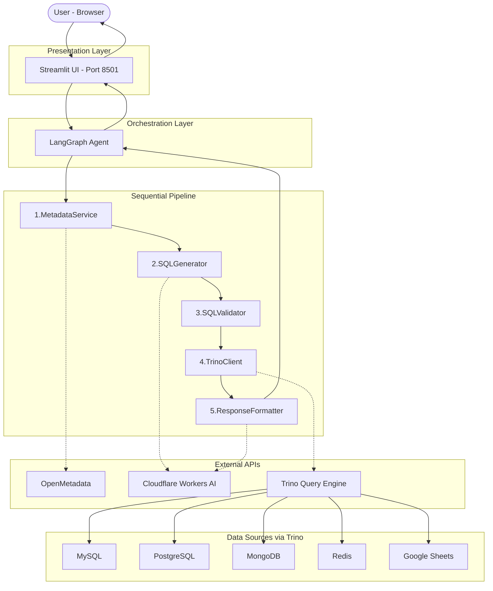
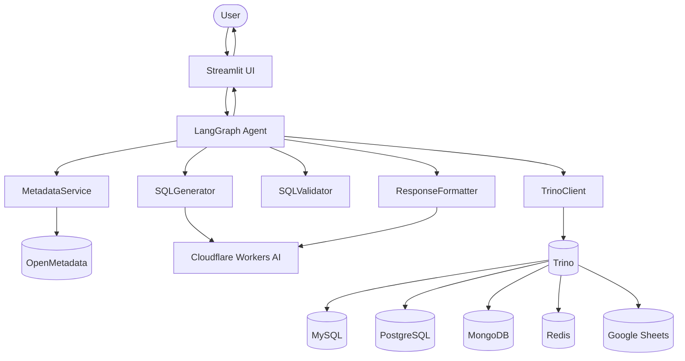
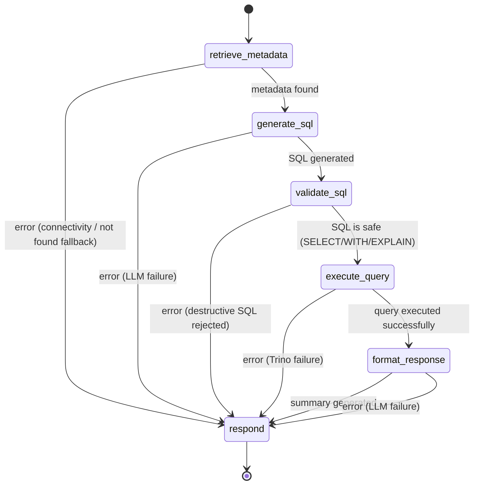
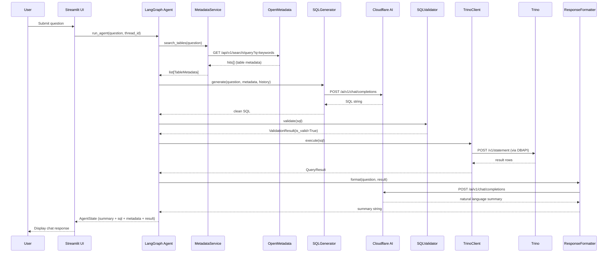
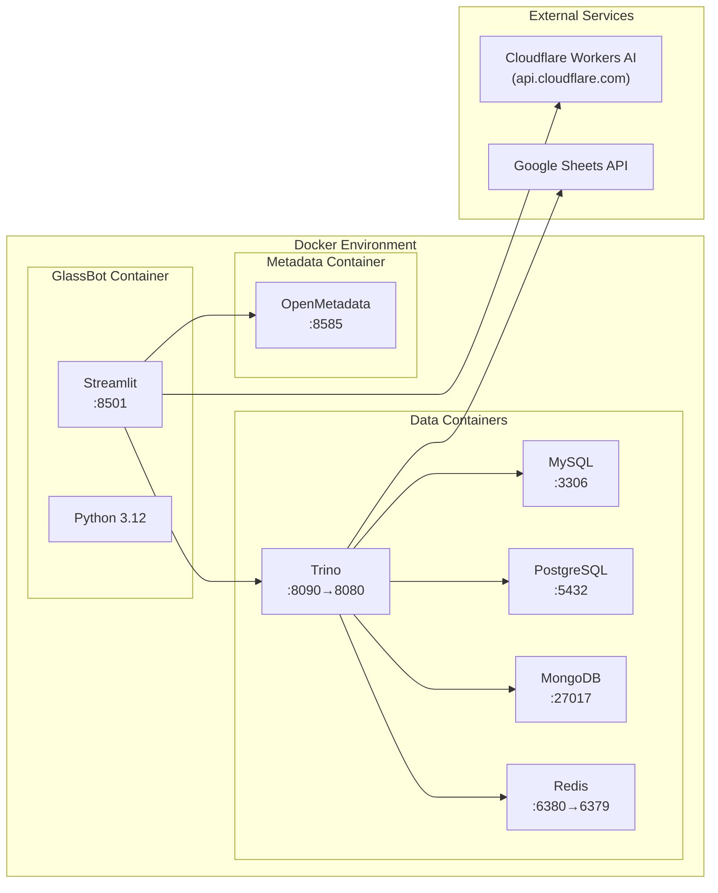

# GlassBot — High-Level Design Document

## 1. Project Overview

GlassBot is an AI-powered conversational analytics assistant for the Glass Bottle Manufacturing domain. It allows manufacturing analysts and operators to query production data across multiple heterogeneous databases using natural language — no SQL knowledge required.

The system translates questions like *"Show me completed production orders"* into correct Trino SQL, executes it across MySQL, PostgreSQL, MongoDB, Google Sheets, and Redis via a federated Trino query engine, and returns results as both raw data tables and plain-English summaries.

---

## 2. Architecture Overview

### System Block Diagram

### Data Flow Diagram

### Agent Pipeline — State Graph

### Component Interaction Sequence

### Deployment Block Diagram

---

## 3. Technology Stack

| Layer | Technology | Purpose |
|-------|-----------|---------|
| Frontend | Streamlit | Chat UI, data display |
| Agent Framework | LangGraph (LangChain) | Pipeline orchestration with state graph |
| LLM | Cloudflare Workers AI (Llama 3.3 70B) | SQL generation & result summarisation |
| Query Engine | Trino | Federated SQL across all data sources |
| Metadata Catalog | OpenMetadata | Table/column discovery and search |
| Databases | MySQL, PostgreSQL, MongoDB, Redis, Google Sheets | Source data stores |

---

## 4. Data Sources

| Catalog | Schema | Table | Data |
|---------|--------|-------|------|
| `mysql` | `trino_glassbottle` | `customer_orders` | Sales orders (35+ rows) |
| `postgres` | `public` | `production_orders` | Manufacturing orders (35+ rows) |
| `mongodb` | `trino_glassbottle` | `machine_sensor_logs` | Machine IoT sensor data (100+ docs) |
| `gsheets` | `default` | `trino_glassbottle_production_target` | Daily targets (30+ rows) |
| `redis` | `default` | `machine`, `production`, `shift`, `dashboard` | Real-time KPIs (key-value) |

---

## 5. External APIs Used

### 5.1 OpenMetadata REST API

| Endpoint | Method | Purpose |
|----------|--------|---------|
| `/api/v1/search/query` | `GET` | Full-text search for tables matching a user question |

**Parameters:**
- `q` — search query (extracted keywords from user question)
- `index` — always `table_search_index`
- `size` — max results (default: 5)

**Authentication:** Bearer token via `Authorization: Bearer {OPENMETADATA_API_TOKEN}`

**Response:** Returns Elasticsearch-style hits with `_source` documents containing table metadata (FQN, columns, descriptions, tags).

### 5.2 Trino DBAPI

| Protocol | Method | Purpose |
|----------|--------|---------|
| Trino HTTP Protocol | `POST /v1/statement` | Submit SQL for execution (via `trino` Python DBAPI) |

**Connection parameters:**
- `host` — Trino coordinator hostname
- `port` — HTTP port (default: 8090)
- `user` — username for query attribution
- `catalog` — default catalog
- `schema` — default schema

**Used by:** `TrinoClient.execute(sql)` via the `trino` PyPI package's DBAPI interface.

### 5.3 Cloudflare Workers AI

| Endpoint | Method | Purpose |
|----------|--------|---------|
| `/client/v4/accounts/{account_id}/ai/v1/chat/completions` | `POST` | LLM inference (SQL generation + summarisation) |

**Authentication:** Bearer token via `Authorization: Bearer {CLOUDFLARE_AIG_TOKEN}`

**Model:** `@cf/meta/llama-3.3-70b-instruct-fp8-fast`

**Request format:** OpenAI-compatible chat completions (messages array with system/user/assistant roles).

---

## 6. Key Design Decisions

1. **LangGraph over plain chains** — explicit node graph with conditional routing gives inspectable error handling at every step.
2. **Federated Trino** — single SQL interface to query MySQL + Postgres + MongoDB + Redis + Google Sheets simultaneously, including cross-database JOINs.
3. **Cloudflare Workers AI** — free-tier LLM access via custom `BaseChatModel` adapter, avoiding OpenAI costs.
4. **SQL validation before execution** — allowlist/blocklist ensures only SELECT/WITH/EXPLAIN statements reach Trino.
5. **Hardcoded schema fallback** — when OpenMetadata search fails, the system still works using the known table schemas embedded in the system prompt.

---

## 7. Pipeline Flow (Happy Path)

1. **User** submits question via Streamlit chat
2. **MetadataService** extracts keywords, searches OpenMetadata, returns table schemas
3. **SQLGenerator** builds prompt (system prompt + metadata + history + question), calls Cloudflare LLM
4. **SQLValidator** checks the generated SQL against allowlist/blocklist
5. **TrinoClient** executes the validated SQL, captures timing
6. **ResponseFormatter** calls the LLM to summarise results in plain English
7. **Streamlit UI** renders summary, SQL expander, metadata expander, data table

---

## 8. Error Handling Strategy

Every node catches exceptions, logs them, and writes a user-friendly message to `state["error"]`. The conditional router then skips all remaining nodes and jumps to `respond`, which surfaces the error in the UI.

| Error Type | Source | User sees |
|-----------|--------|-----------|
| `MetadataConnectivityError` | OpenMetadata unreachable | "Could not retrieve table metadata" |
| `MetadataNotFoundError` | No tables found | Falls back to hardcoded schemas (transparent) |
| `LLMError` | Cloudflare API failure | "Failed to generate SQL" |
| `SQLValidationError` | Destructive SQL detected | "Query rejected: DELETE not allowed" |
| `QueryExecutionError` | Trino error | "Query execution failed: ..." |
| `ConfigurationError` | Missing env vars | Startup error with setup instructions |
