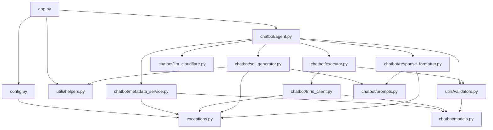
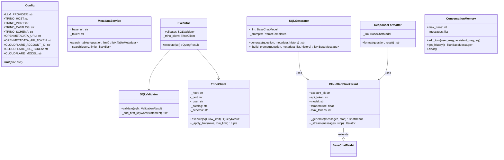

# GlassBot — Low-Level Design Document

## 1. Module Structure

### Module Dependency Diagram



### Class Diagram



### File Tree

```
polaris-poc/
├── app.py                          # Streamlit entry point
├── config.py                       # Environment config & validation
├── exceptions.py                   # Domain exception hierarchy
├── chatbot/
│   ├── agent.py                    # LangGraph StateGraph orchestrator
│   ├── executor.py                 # Validate-then-execute coordinator
│   ├── llm_cloudflare.py           # Custom Cloudflare Workers AI adapter
│   ├── memory.py                   # Conversation history store
│   ├── metadata_service.py         # OpenMetadata REST client
│   ├── models.py                   # Data models (dataclasses)
│   ├── prompts.py                  # System prompt & templates
│   ├── response_formatter.py       # LLM-based result summariser
│   ├── sql_generator.py            # LLM-based SQL generator
│   └── trino_client.py             # Trino DBAPI wrapper
├── utils/
│   ├── helpers.py                  # Token counting, trimming, formatting
│   ├── logger.py                   # Logging factory
│   └── validators.py               # SQL safety validator (sqlparse)
└── tests/                          # Unit, property, and integration tests
```

---

## 2. Data Models (`chatbot/models.py`)

```python
@dataclass
class ColumnInfo:
    name: str           # Column name
    data_type: str      # Trino data type
    description: str | None

@dataclass
class TableMetadata:
    fqn: str            # "catalog.schema.table"
    name: str
    description: str | None
    columns: list[ColumnInfo]
    tags: list[str]
    relationships: list[str]

@dataclass
class QueryResult:
    rows: list[dict[str, Any]]
    row_count: int
    execution_time_ms: float
    truncated: bool
    truncation_limit: int | None

@dataclass
class ValidationResult:
    is_valid: bool
    statement_type: str | None   # "SELECT", "DELETE", etc.
    error_message: str | None
```

---

## 3. Agent State (`AgentState` TypedDict)

```python
class AgentState(TypedDict):
    question: str                           # User's raw question
    conversation_history: list[BaseMessage]  # Multi-turn context
    metadata: list[TableMetadata] | None    # From OpenMetadata
    sql: str | None                         # Generated SQL
    validation_result: ValidationResult | None
    query_result: QueryResult | None
    summary: str | None                     # Natural language answer
    error: str | None                       # Error message (triggers short-circuit)
    error_source: str | None                # Component that errored
```

---

## 4. Graph Nodes — Detailed Logic

### 4.1 `retrieve_metadata(state, metadata_service)`

```
Input:  state["question"]
Output: state["metadata"] OR state["error"]

Logic:
  1. Extract keywords from question (strip stop-words)
  2. Search OpenMetadata API: GET /api/v1/search/query?q={keywords}&index=table_search_index&size=5
  3. If no results → try individual tokens
  4. If still empty → return hardcoded fallback tables (8 tables)
  5. Parse hits → TableMetadata dataclasses
```

### 4.2 `generate_sql(state, sql_generator)`

```
Input:  state["question"], state["metadata"], state["conversation_history"]
Output: state["sql"] OR state["error"]

Logic:
  1. Build prompt: [SystemMessage(SYSTEM_PROMPT), SystemMessage(metadata_context), ...history, HumanMessage(question)]
  2. Call Cloudflare LLM: POST /ai/v1/chat/completions
  3. Strip markdown fences from response
  4. Return clean SQL string
```

### 4.3 `validate_sql(state)`

```
Input:  state["sql"]
Output: state["validation_result"] OR state["error"]

Logic:
  1. sqlparse.parse(sql) → token AST
  2. Walk tokens, skip whitespace/comments
  3. Find first DML/Keyword token
  4. If in ALLOWLIST {SELECT, WITH, EXPLAIN} → valid
  5. If in BLOCKLIST {DELETE, UPDATE, INSERT, DROP, ALTER, TRUNCATE, CREATE} → reject
  6. If unparseable → reject with "unparseable-SQL"
```

### 4.4 `execute_query(state, trino_client)`

```
Input:  state["sql"]
Output: state["query_result"] OR state["error"]

Logic:
  1. Strip trailing semicolons
  2. Connect: trino.dbapi.connect(host, port, user, catalog, schema)
  3. Execute SQL with time.perf_counter() wall-clock timing
  4. Fetch row_limit+1 rows to detect truncation
  5. If > 1000 rows: truncate to 1000, set truncated=True
  6. Return QueryResult with rows, timing, truncation info
```

### 4.5 `format_response(state, response_formatter)`

```
Input:  state["question"], state["query_result"]
Output: state["summary"] OR state["error"]

Logic:
  1. If row_count == 0: return canned "no data" message (no LLM call)
  2. Build prompt with SUMMARY_PROMPT + first 100 rows + row_count + execution_time
  3. Call Cloudflare LLM
  4. Safety net: append row_count/exec_time if LLM omitted them
```

### 4.6 `respond(state)`

```
Terminal node — no mutations. Marks graph execution complete.
```

---

## 5. Routing Logic

```python
def _route(state, next_node):
    if state.get("error"):
        return "respond"    # Short-circuit to terminal
    return next_node        # Continue pipeline

# Applied after each node:
retrieve_metadata → generate_sql OR respond
generate_sql      → validate_sql OR respond
validate_sql      → execute_query OR respond
execute_query     → format_response OR respond
format_response   → respond
respond           → END
```

---

## 6. OpenMetadata API Integration — Detailed

### Endpoint Used

```
GET {OPENMETADATA_URL}/api/v1/search/query
```

### Request

```http
GET /api/v1/search/query?q=production+orders&index=table_search_index&size=5
Authorization: Bearer {OPENMETADATA_API_TOKEN}
Content-Type: application/json
```

### Response Structure

```json
{
  "hits": {
    "hits": [
      {
        "_source": {
          "fullyQualifiedName": "Trino_GlassBottle_Production_Orders.trino_glassbottle.public.production_orders",
          "name": "production_orders",
          "description": "Production orders table",
          "columns": [
            {"name": "production_id", "dataType": "INT", "description": "PK"},
            {"name": "status", "dataType": "VARCHAR", "description": "Order status"}
          ],
          "tags": [{"tagFQN": "Domain.Manufacturing"}]
        }
      }
    ]
  }
}
```

### FQN Translation

OpenMetadata uses 4-part FQNs (`service.connection.schema.table`). GlassBot's system prompt contains the authoritative Trino 3-part FQNs — the OpenMetadata metadata is supplementary context only.

| OpenMetadata FQN | Trino FQN |
|-----------------|-----------|
| `Trino_GlassBottle_Sales Orders.trino_glassbottle.trino_glassbottle.customer_orders` | `mysql.trino_glassbottle.customer_orders` |
| `Trino_GlassBottle_Production_Orders.trino_glassbottle.public.production_orders` | `postgres.public.production_orders` |
| `Trino_GlassBottle_Machine_Logs.trino_glassbottle.trino_glassbottle.machine_sensor_logs` | `mongodb.trino_glassbottle.machine_sensor_logs` |
| `Trino_GlassBottle_Production_Target.trino_glassbottle_production_target.default.target` | `gsheets.default.trino_glassbottle_production_target` |

### Keyword Extraction

Before searching, the question is pre-processed:

```python
"Give me completed production orders"
→ strip stop-words: ["give", "me"]
→ result: "completed production orders"
```

### Fallback Strategy

1. Search with full keywords → check hits
2. If empty → try each token individually
3. If still empty → return 8 hardcoded `TableMetadata` objects

---

## 7. Trino DBAPI Integration — Detailed

### Connection

```python
import trino.dbapi
conn = trino.dbapi.connect(
    host="localhost",       # TRINO_HOST
    port=8090,             # TRINO_PORT
    user="glassbot",       # TRINO_USER
    catalog="mysql",       # TRINO_CATALOG
    schema="trino_glassbottle"  # TRINO_SCHEMA
)
```

### Execution Protocol

The `trino` Python package uses Trino's HTTP protocol internally:

```
POST http://{host}:{port}/v1/statement
Content-Type: text/plain

SELECT order_id, customer_name FROM mysql.trino_glassbottle.customer_orders LIMIT 100
```

Trino responds with a polling URL. The DBAPI client polls until results are ready, then fetches rows.

### Key Behaviours

| Behaviour | Implementation |
|-----------|---------------|
| Semicolon stripping | `sql.strip().rstrip(";").strip()` before execute |
| Row limit | Fetch `row_limit + 1` rows; truncate if > 1000 |
| Timing | `time.perf_counter()` before/after execute |
| Error handling | Catch `TrinoQueryError` → re-raise as `QueryExecutionError` with `from None` (no traceback) |
| Connection lifecycle | New connection per query; closed in `finally` block |

### Cross-Database Joins

Trino enables JOINs across different catalogs:

```sql
SELECT c.customer_name, p.production_date, p.status
FROM mysql.trino_glassbottle.customer_orders c
JOIN postgres.public.production_orders p ON c.order_number = p.order_number
LIMIT 100
```

---

## 8. Cloudflare Workers AI Integration — Detailed

### Endpoint

```
POST https://api.cloudflare.com/client/v4/accounts/{ACCOUNT_ID}/ai/v1/chat/completions
```

### Request

```json
{
  "model": "@cf/meta/llama-3.3-70b-instruct-fp8-fast",
  "messages": [
    {"role": "system", "content": "You are a Trino SQL expert..."},
    {"role": "system", "content": "Additional context from metadata..."},
    {"role": "user", "content": "Show me completed production orders"}
  ],
  "temperature": 0.0,
  "max_tokens": 2048
}
```

### Response

```json
{
  "choices": [
    {
      "message": {
        "content": "SELECT order_number, product_code, quantity, production_date, status\nFROM postgres.public.production_orders\nWHERE status = 'Completed'\nLIMIT 100"
      }
    }
  ]
}
```

### Custom Adapter (`chatbot/llm_cloudflare.py`)

Implements `BaseChatModel` from LangChain so it's fully interchangeable with OpenAI/Anthropic:

```python
class CloudflareWorkersAI(BaseChatModel):
    account_id: str
    api_token: str
    model: str
    temperature: float = 0.0
    max_tokens: int = 2048

    def _generate(self, messages, stop=None, **kwargs) -> ChatResult:
        # POST to Cloudflare endpoint
        # Parse OpenAI-compatible response
        # Return ChatResult
```

---

## 9. SQL Validation (`utils/validators.py`)

### Algorithm

```
1. Strip whitespace
2. sqlparse.parse(sql) → list of Statement objects
3. Flatten first statement's tokens
4. Skip: whitespace tokens, Comment.Single, Comment.Multiline
5. First non-skipped token must be:
   - DML type (SELECT, INSERT, UPDATE, DELETE)
   - DDL type (CREATE, DROP, ALTER, TRUNCATE)
   - CTE type (WITH)
   - Keyword type (EXPLAIN)
6. Normalise to uppercase
7. Check ALLOWLIST → valid
8. Check BLOCKLIST → reject with error message
9. Otherwise → reject as "unparseable-SQL"
```

### Constants

```python
ALLOWLIST = {"SELECT", "WITH", "EXPLAIN"}
BLOCKLIST = {"DELETE", "UPDATE", "INSERT", "DROP", "ALTER", "TRUNCATE", "CREATE"}
```

---

## 10. Configuration (`config.py`)

### Required Variables

| Variable | Purpose |
|----------|---------|
| `LLM_PROVIDER` | Provider identifier (e.g., `cloudflare`) |
| `TRINO_HOST` | Trino coordinator hostname |
| `TRINO_CATALOG` | Default Trino catalog |
| `TRINO_SCHEMA` | Default Trino schema |
| `OPENMETADATA_URL` | OpenMetadata base URL |
| `OPENMETADATA_API_TOKEN` | JWT bearer token |

### Cloudflare-Specific Variables

| Variable | Purpose |
|----------|---------|
| `CLOUDFLARE_ACCOUNT_ID` | Cloudflare account |
| `CLOUDFLARE_AIG_TOKEN` | AI Gateway bearer token |
| `CLOUDFLARE_MODEL` | Model identifier |

### Behaviour

- Loaded from `.env` via `python-dotenv` at import time
- Missing required vars → `ConfigurationError` with var name in message
- `GLASSBOT_SKIP_CONFIG=1` suppresses singleton for tests

---

## 11. Exception Hierarchy

```
GlassBotError
├── ConfigurationError         # Missing/invalid env vars
├── MetadataConnectivityError  # OpenMetadata unreachable
├── MetadataNotFoundError      # No tables found
├── SQLValidationError         # Destructive SQL rejected
├── QueryExecutionError        # Trino execution failure
└── LLMError                   # Cloudflare API failure
```

---

## 12. Session & Memory Management

- **Session ID:** UUID stored in `st.session_state.thread_id`
- **Message history:** List of dicts in `st.session_state.messages`
- **LangGraph checkpointer:** `MemorySaver()` keyed by `thread_id`
- **Conversation trimming:** `trim_messages` keeps recent turns within token budget
- **Clear conversation:** Resets messages + generates new `thread_id`

---

## 13. Type Casting Rules in Generated SQL

| Scenario | Correct SQL | Why |
|----------|------------|-----|
| GSheets date comparison | `WHERE "date" = '2026-07-08'` | `"date"` is varchar, not date type |
| GSheets numeric comparison | `CAST("planned qty" AS integer) > CAST("actual qty" AS integer)` | Columns are varchar |
| Redis key join | `ON rm._key = 'machine:' \|\| po.machine_id` | Redis keys have prefixes |
| MongoDB→Postgres join | `CAST(msl.productionid AS integer) = po.production_id` | productionid is varchar, production_id is integer |

---

## 14. Docker Deployment

```dockerfile
FROM python:3.12-slim
WORKDIR /app
COPY requirements.txt .
RUN pip install --no-cache-dir -r requirements.txt
COPY . /app
EXPOSE 8501
CMD ["streamlit", "run", "app.py", "--server.port=8501", "--server.address=0.0.0.0"]
```

```yaml
# docker-compose.yml
services:
  glassbot:
    build: .
    ports: ["8501:8501"]
    env_file: .env
    restart: unless-stopped
```
